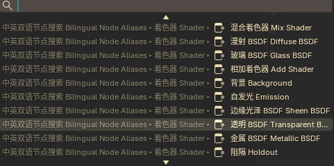

# Bilingual Add Search · 中英双语添加搜索

[](https://github.com/dandel34/bilingual-add-search/actions/workflows/ci.yml)
[](https://github.com/dandel34/bilingual-add-search/releases)
[](LICENSE)
[](https://www.blender.org)

**Search Blender's Shift+A menus in Chinese *or* English — one item, two languages.**
在 Blender 的「添加」菜单（Shift+A）与节点菜单里，中文、英文关键词都能搜到同一个条目。



> 截图：材质（着色器）节点 Shift+A 的搜索结果 —— 中英文关键词都能命中同一条目。
> 1.2.0 起前缀已缩短为 `BNA`，可用新截图替换 `docs/screenshot-search.png`。

## English quick start

| | |
| --- | --- |
| **What it does** | Adds bilingual alias entries to the 3D View **Add** menu (`Shift+A`) and the Node Editor **Add** menu, so `cube` *or* `立方体` (nodes: `noise` *or* `噪波纹理`) find the same item. Blender's built-in menus are left untouched. |
| **Coverage** | 3D View objects: 77 aliases / 13 categories · Nodes: 642 aliases / 88 categories — shader (material), compositor, texture and geometry node trees. |
| **Install** | Blender 4.2+: install `bilingual_add_search-<version>.zip` ([Releases](../../releases)) — or this repo's own `Code ▸ Download ZIP` — via `Edit ▸ Preferences ▸ Add-ons ▸ ⌄ ▸ Install from Disk`. Blender 3.x–4.1: use `dist/bilingual_add_search.py` as a single-file add-on. |
| **Use** | Press `Shift+A` and start typing. Alias entries show up as `BNA ‣ Texture ‣ 噪波纹理 Noise Texture`; category words (`texture` / `纹理`) work as filters too. |
| **Extras** | `Shift+Alt+L` toggles the UI language (zh_HANS ⇄ en_US). The search prefix `BNA` is configurable in the add-on preferences. |
| **Compatibility** | Blender 3.x ～ 5.x (developed and verified on 5.2.2 LTS), Windows / macOS / Linux. |
| **License** | GPL-3.0-or-later |

---

## 中文说明

**Shift+A 打开「添加」菜单后，搜索框里输入中文或英文，都能找到同一个条目。**

- 3D 视图：输入 `cube` 或 `立方体` → 同一个立方体
- 材质/着色器节点：输入 `noise` 或 `噪波纹理` → 同一个噪波纹理节点
- 顺带覆盖合成、纹理、几何节点编辑器

当前版本 **1.2.0**：1.0.0 只有 3D 视图物体添加菜单；1.1.0 增加节点菜单；
1.2.0 把搜索结果里的长前缀缩短为 **`BNA`**（可在偏好设置里改成任意文字）。

---

## 一、可行性结论：可以做到 ✅

### 为什么可以

Blender 的菜单搜索在绘制菜单时，会把每个条目拼成

```
"<菜单路径> ‣ <按钮文本>"
```

再用这个字符串做匹配（`interface_template_search_menu.cc` 的
`menu_items_from_ui_create_item_from_button` 取 `but->drawstr`，
`menu_search_update_fn` 对 `drawwstr_full` 做 `StringSearch`），
而且 `menu_stack` 会**递归展开任意层级的子菜单**。

所以：只要往菜单里挂「中文名 + 英文名」双语的别名条目，原生搜索框就能用任意一种语言命中，
既不用改 Blender 内置菜单，也不用改匹配算法。

参考源码：
[interface_template_search_menu.cc](https://projects.blender.org/blender/blender/src/branch/main/source/blender/editors/interface/templates/interface_template_search_menu.cc)

### 为什么不能「直接改原生搜索」

匹配用的字符串是 C 代码绘制菜单时生成的，Python 只能决定「菜单里有什么」，
改不了匹配算法，也改不了内置条目的翻译文本。因此方案是
**新增双语别名条目**：原生菜单保持原样，只在菜单末尾追加别名子菜单。

### 两条菜单的实现差异

| | 3D 视图「添加」菜单 | 节点编辑器「添加」菜单 |
| --- | --- | --- |
| 挂载点 | `VIEW3D_MT_add` | `NODE_MT_add` |
| 条目数据 | 内置别名表（77 条，中文名取 Blender 官方译名并固化） | `bl_ui/node_add_menu_*.py` 提取的 642 条（4 种节点树、88 个分类） |
| 标签来源 | 直接写死中英对照 | 英文名实时读 RNA（`bl_rna.name`），中文名实时查 Blender 自带 `zh_HANS/zh_HANT` 词条 |
| 好处 | 零依赖，任何界面语言下都能搜 | 随 Blender 升级自动更新，且与官方中文名完全一致 |

节点部分实测：527 个不同节点标签，**中文缺失 0 条**。

---

## 二、安装

这个仓库本身就是标准扩展包（根目录有 `__init__.py` + `blender_manifest.toml`），三种装法：

| 方式 | 用什么 | 适用 |
| --- | --- | --- |
| A（推荐） | [Releases](../../releases) 里的 `bilingual_add_search-<版本>.zip` | Blender 4.2+ / 5.x |
| B（不用等 Release） | 仓库页 `Code ▸ Download ZIP`，再把这个 zip 从磁盘安装 | Blender 4.2+ / 5.x |
| C（老版本 / 单文件） | `dist/bilingual_add_search.py` | Blender 3.x ～ 4.1 |

统一操作：**编辑 → 偏好设置 → 插件 → 右上角 ⌄ → 从磁盘安装**，选择上面的文件 →
在列表里勾选启用（搜索 `Bilingual` 或 `中英`）。

老版本也可以用单文件方式：把 `dist/bilingual_add_search.py` 复制到用户插件目录后重启 Blender：

```
%APPDATA%\Blender Foundation\Blender\5.2\scripts\addons\
```

> - **方式 B 为什么可行（已实测）**：仓库根目录就是扩展包（`__init__.py` + `blender_manifest.toml`），
>   Blender 按 manifest 识别包，所以 GitHub 的 Download ZIP（里面那层 `bilingual-add-search-main/`
>   目录名带连字符也没关系）可以直接从磁盘安装。
> - **开发/自用**：把整个仓库文件夹丢进 `scripts/addons/`（连字符目录名也能被识别，已实测），
>   或在偏好设置 → 文件路径里把仓库所在目录加为脚本目录。
> - 打 tag（如 `git tag v1.2.1 && git push --tags`）会触发 GitHub Actions 自动打包 zip
>   并创建对应的 Release，见 `.github/workflows/release.yml`。

---

## 三、用法

### 3D 视图（物体模式）

1. 鼠标放在 3D 视图，按 **Shift+A**，**直接开始输入**（不用点搜索框）。
2. 中英文随你：`cube` / `立方体`、`uv sphere` / `经纬球`、`light` / `灯光`、`empty` / `空物体`、
   `force field` / `力场`、`mesh` / `网格` …（分类名本身也可搜）
3. 结果出现 «添加 ‣ **BNA** ‣ 网格 Mesh ‣ 立方体 Cube»，回车或点击即可创建。

77 条别名，13 个分类：网格 / 曲线 / 曲面 / 融球 / 文本·点云·其他 / 蜡笔 / 骨架·晶格 /
空物体 / 图像 / 灯光 / 光照探针 / 摄像机·体积 / 力场。

### 材质与其它节点（着色器 / 合成 / 纹理 / 几何 节点编辑器）

1. 打开着色器编辑器（材质模式），按 **Shift+A**，**直接开始输入**。
2. 例如：
   - `noise` / `噪波纹理`、`image texture` / `图像纹理`、`principled` / `原理化 BSDF`
   - `voronoi` / `沃罗诺伊纹理`、`color ramp` / `颜色渐变`、`bump` / `凹凸`
   - `mix` / `混合`、`map range` / `映射范围`、`material output` / `材质输出`
   - 分类名同样可搜：`texture` / `纹理`、`shader` / `着色器`、`utilities` / `实用工具`
3. 结果出现 «添加 ‣ **BNA** ‣ 着色器 Shader ‣ 混合着色器 Mix Shader»，点击即添加节点，
   拖动摆放行为与原生条目一致。

覆盖范围（全部照抄官方菜单的分类结构）：

| 节点树 | 节点条目 | 顶层分类 |
| --- | --- | --- |
| 着色器 ShaderNodeTree | 99 | 输入 / 输出 / 着色器 / 颜色 / 纹理 / 实用工具 / 置换 |
| 合成 CompositorNodeTree | 164 | 输入 / 输出 / 颜色 / 滤镜 / 抠像 / 遮罩 / 追踪 / 变换 / 纹理 / 实用工具 / 创意 |
| 纹理 TextureNodeTree | 33 | 输入 / 输出 / 颜色 / 转换器 / 畸变 / 图案 / 纹理 |
| 几何 GeometryNodeTree | 346 | 属性 / 颜色 / 曲线 / 蜡笔 / 几何数据 / 输入 / 实例 / 网格 / 输出 / 点 / 模拟 / 实用工具 / 纹理 / 体积 |

（节点编辑器按当前节点树类型自动只显示对应的一套分类。）

### 一键切换界面语言

- 快捷键 **Shift+Alt+L**（可在偏好里关闭）
- 或：别名菜单里的「切换界面语言」按钮、插件偏好设置里的按钮
- 默认在 **简体中文 (`zh_HANS`) ⇄ English (`en_US`)** 之间切换，语言对可改
- 偏好里还有「切换语言后立即保存用户设置」开关（默认不保存）

### 偏好设置里的开关

- 在「添加」菜单中显示双语别名（物体）
- 在节点「添加」菜单中显示双语别名
- 别名菜单中显示语言切换按钮
- 启用语言切换快捷键 Shift+Alt+L
- **搜索前缀**：默认 `BNA`（物体与节点共用）。它既是别名子菜单在「添加」菜单里的按钮文本，
  也是搜索结果里的路径前缀（Blender 用「按钮文本 ‣ 分类 ‣ 条目」拼搜索路径）。
  想更短/更直观都可以改，例如改成 `双`、`CN/EN`、`双语别名` 等；留空则回落到 `BNA`。

---

## 四、覆盖范围与限制

- 只处理 **Shift+A 的添加菜单**：3D 视图物体添加菜单 + 节点编辑器添加菜单；
  节点编辑器的「Swap 菜单」、编辑模式菜单、其它编辑器菜单不处理。
- 节点别名覆盖 **Blender 内置节点**；第三方插件注册的节点不会出现在别名表里
  （重新运行 `tools/extract_node_menu.py` + `tools/build_node_table.py` 也不会包含它们）。
- 节点编辑器「组 Group」子菜单里的自定义节点组不会双语化（名字是用户自定义的）。
- 搜索时同一条目可能出现两行（原生条目 + 别名条目），两行都能正常执行。
- 中文别名取 Blender 自带的简体译名（节点部分也支持 zh_HANT 词条）；搜繁体（如「立方體」）
  在物体部分不会命中，可自行在别名表里补。
- 别名标签本身就是可搜索文本，所以「网格」「mesh」「纹理」「texture」这类**分类词**也能用来筛选整类条目。

---

## 五、仓库结构与维护

仓库根目录**就是标准扩展包**（可提交到 extensions.blender.org，也可直接打包安装）：

```
bilingual-add-search/
├─ __init__.py                      # 插件本体（扩展包入口，同时也是完整源码）
├─ blender_manifest.toml            # 扩展 manifest（由 tools/build_extension.py 依据 bl_info 生成）
├─ dist/                            # 发行产物（由脚本生成，故意提交进仓库）
│  ├─ bilingual_add_search-1.2.0.zip# 扩展包安装包（zip 内为 bilingual_add_search/ 子目录）
│  └─ bilingual_add_search.py       # 旧版单文件（Blender 3.x–4.1 用）
├─ docs/screenshot-search.png       # README 截图
├─ tools/                           # 数据提取 / 打包 / 校验脚本（终端用户无需运行）
│  ├─ extract_add_menu.py           # 解析 bl_ui/space_view3d.py → add_menu_tree.json
│  ├─ extract_node_menu.py          # 解析 bl_ui/node_add_menu_*.py → node_menu_tree.json
│  ├─ build_node_table.py           # 把节点别名表写回 __init__.py（幂等）
│  ├─ build_extension.py            # 生成 manifest + dist/ 里的 zip 与单文件（可重现构建）
│  ├─ check_package.py              # 校验 manifest / zip / 单文件与源码一致（CI 同款）
│  └─ *.json                        # 别名表数据与官方中文译名快照
├─ .github/workflows/               # CI 与 Release 自动化
├─ CHANGELOG.md
├─ LICENSE                          # GPL-3.0-or-later
└─ README.md
```

- 插件启动时会自动校验：物体别名（算子/枚举/图标）与节点别名（`Node.bl_rna_get_subclass`），
  失效条目跳过并打印日志，**不会在点击时报错**；若 Blender 缺少中文词条，
  节点别名自动退化为英文标签（英文搜索仍然可用）。
- 改完源码后请运行 `python tools/build_extension.py`（同步 manifest 与 dist/）并
  `python tools/check_package.py`；重建别名表见 `tools/README.md`。

### 许可

GPL-3.0-or-later（与 `bl_info`、扩展 manifest 中的 SPDX 声明一致）。
完整文本：<https://www.gnu.org/licenses/gpl-3.0.txt>

---

## 六、已在本机 Blender 5.2.2 (d13f752e3b9c) 完成的验证

**功能**

- 物体别名：77 条全部通过算子 + 枚举 + 图标校验，0 条被丢弃。
- 节点别名：4 种节点树、88 个分类、642 条、93 个分类菜单类；527 个标签中
  **中文缺失 0 条、英文缺失 0 条**；抽样 噪波纹理/Noise Texture、原理化 BSDF/Principled BSDF、
  颜色渐变/Color Ramp、沃罗诺伊纹理/Voronoi Texture 均与官方中文一致。
  另有 6 条的官方中文与英文相同（`ID`、`Cryptomatte`、`CSV (.csv)`、`Wavefront (.obj)`、
  `STL (.stl)`、`OpenVDB (.vdb)`），与中文界面下 Blender 自身显示一致。
- 分类层级与官方一致（着色器：输入 → 常值；实用工具 → 矢量、运算；置换 …）。
- 挂载/卸载干净：`VIEW3D_MT_add` 与 `NODE_MT_add` 的 draw 链在注册后为
  `['draw', '_draw_add_menu_entry' / '_draw_node_menu_entry']`，注销后回到 `['draw']`；
  重复注册正常。
- 性能：中文词条懒加载 70 ms（仅第一次打开别名菜单），标签构建 1.5 ms，之后命中缓存。
- `Shift+Alt+L` 语言切换生效（`en_US → zh_HANS`，`pgettext_iface('Cube')` 返回 `立方体`）。
- 1.2.0 前缀：两个别名根菜单的 `bl_label` 与钩子传入的按钮文本都是 `BNA`，
  自定义前缀（含留空回落）也已验证；用假 layout 重画着色器整棵树仍为 99 条。

**安装**

- 单文件 `.py`：`addon_install` + `addon_enable` 成功。
- 扩展 zip：`extension validate` + `install-file` + `addon_enable` 成功（1.2.0 已重新验证）。

### 你需要做的 10 秒实测

1. 3D 视图 Shift+A → 输入 `cube` → 出现 «添加 ‣ BNA ‣ 网格 Mesh ‣ 立方体 Cube»。
2. 打开着色器编辑器（材质）→ Shift+A → 输入 `noise` → 出现
   «添加 ‣ BNA ‣ 纹理 Texture ‣ 噪波纹理 Noise Texture»；
   清空改输入 `噪波纹理`，同一条目依然在。
